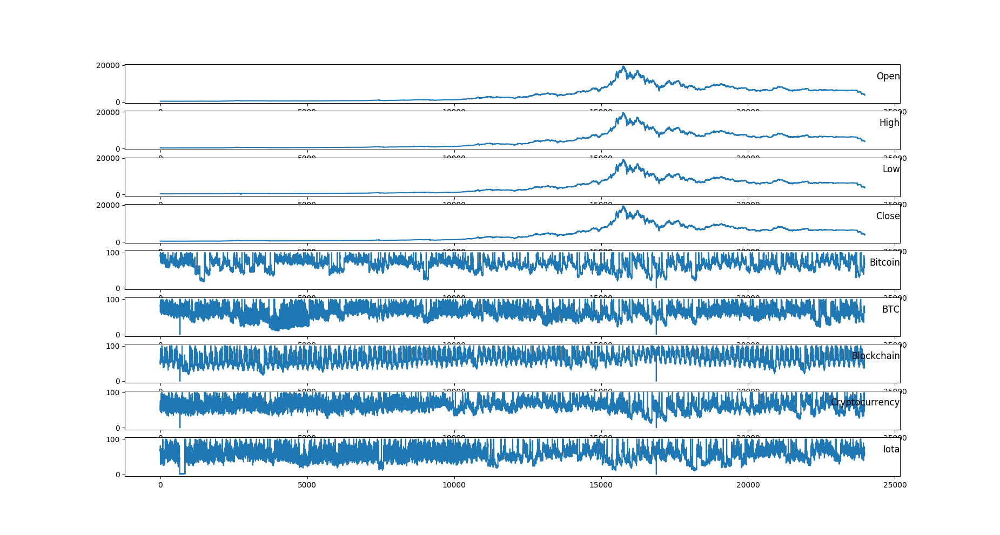
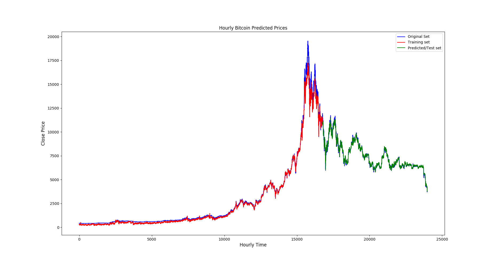
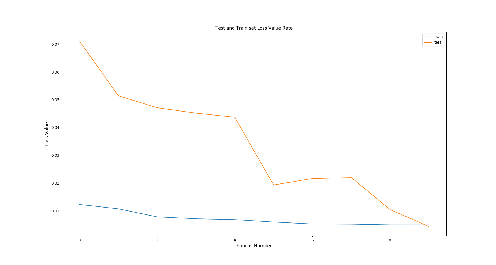
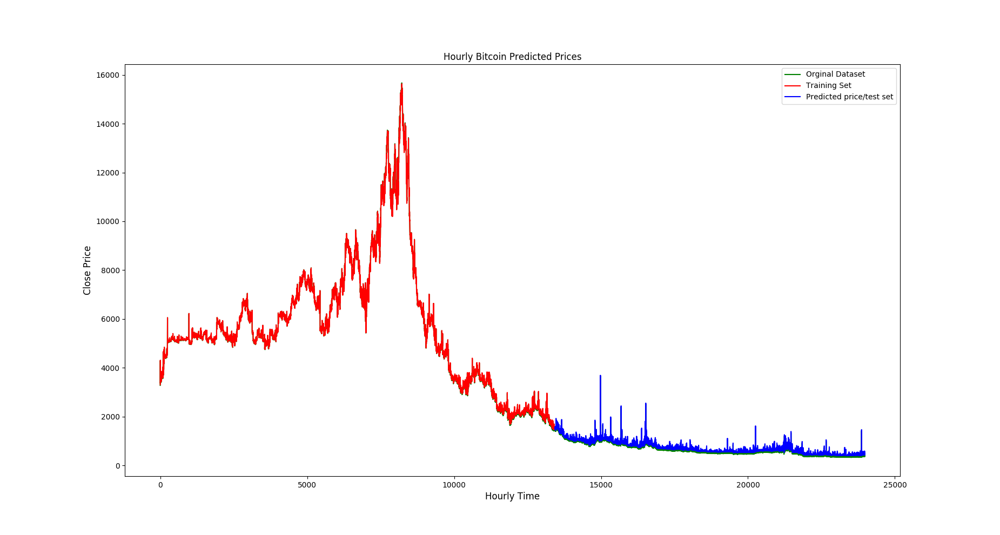

# Bitcoin Price Prediction with LSTM and Google Trends


An experiment in forecasting the **hourly Bitcoin close price** with an **LSTM (Long Short-Term Memory)** network, and in testing whether adding **Google Trends search-interest** features (Bitcoin, BTC, Blockchain, Cryptocurrency, Iota) helps the model.

> **Disclaimer:** This is an educational project. Nothing here is financial advice, and the models are not suitable for trading. See [Known Limitations](#known-limitations) before drawing conclusions from the results.

---

## Table of Contents

1. [Overview](#overview)
2. [Repository Structure](#repository-structure)
3. [Dataset](#dataset)
4. [Methodology](#methodology)
5. [Model Architectures](#model-architectures)
6. [Results](#results)
7. [Getting Started](#getting-started)
8. [Known Limitations](#known-limitations)
9. [Roadmap](#roadmap)
10. [Background: What is an LSTM?](#background-what-is-an-lstm)

---

## Overview

The project asks one question:

> *Does an LSTM predict the Bitcoin close price better when it is also given Google Trends keyword volumes?*

Two models are built on the same hourly dataset:

| Model | Script | Input | Idea |
|---|---|---|---|
| **1D (univariate)** | `LstmFor1D.py` | A single averaged price series | Baseline: price history only |
| **Multivariate ("3D")** | `LstmForMultivariate.py` | 5 market columns + 5 Google Trends columns | Price history plus public search interest |

**Pipeline at a glance**

```
CoinMarketCapWebApp.csv ─┐
                         ├─► DataPreprocess.py ─► Bitcoin3D.csv ─► LstmForMultivariate.py ─► plots + RMSE
GoogleVolume.csv ────────┘
Bitcoin1D.csv ─────────────────────────────────► LstmFor1D.py ────────────────────────────► plot + RMSE
```

---

## Repository Structure

```
.
├── DataPreprocess.py           # Merges price + Google Trends data into Bitcoin3D.csv
├── LstmFor1D.py                # Univariate LSTM
├── LstmForMultivariate.py      # Multivariate LSTM
├── CoinMarketCapWebApp.csv     # Raw hourly price data
├── GoogleVolume.csv            # Raw hourly Google Trends data
├── Bitcoin1D.csv               # Price-only dataset (univariate model)
├── Bitcoin3D.csv               # Merged dataset (multivariate model)
├── images/
│   ├── 1D-PredictionPlot.png
│   ├── 3D-PredictionPlot.png
│   ├── 3D-LossValuePlot.png
│   └── 3D-DistributionColumns.png
└── README.md
```

---

## Dataset

### Sources

- **Price data:** hourly OHLCV, downloaded via the [coinapi.io](https://www.coinapi.io/) API.
- **Search interest:** hourly Google Trends volumes, downloaded with the [`pytrends`](https://github.com/GeneralMills/pytrends) library.
- **Keywords:** `Bitcoin`, `BTC`, `Blockchain`, `Cryptocurrency`, `Iota`.

### Size and coverage

| Property | Value |
|---|---|
| Rows | **23,976** (one per hour, no missing values) |
| Span | 999 days, about early March 2016 to 24 Nov 2018 |
| Frequency | Hourly |
| Price range (Close) | ~\$394 to ~\$19,547 |

### Columns of `Bitcoin3D.csv`

| Column | Description | Range / Notes |
|---|---|---|
| `Date` | Hourly timestamp | Mixed formats (`1/3/2016 0:58`, `24-11-18 23:59`) |
| `Open`, `High`, `Low`, `Close` | Hourly OHLC price (USD) | Close mean ≈ \$4,237 |
| `Volume` | Volume traded | 0.108 to 13,693 |
| `Bitcoin`, `BTC`, `Blockchain`, `Cryptocurrency`, `Iota` | Google Trends relative interest | Integers 0 to 100 |

`Bitcoin1D.csv` contains the same price values under the names `PriceOpen`, `PriceHigh`, `PriceLow`, `PriceClose`, `VolumeTraded`.

### Preprocessing (`DataPreprocess.py`)

1. Load the raw price and Google Trends CSVs.
2. Drop the `#` index column from both, and the duplicate `Date` column from the Google file.
3. Rename the price columns to `Date, Open, High, Low, Close, Volume`.
4. Concatenate the two frames **side by side** (row-aligned) and write `Bitcoin3D.csv`.

### Data overview

Price and Google Trends columns over the full period (Volume omitted):



The price stays low until roughly index 10,000, peaks near \$19,500 around index 15,700, then declines. Google Trends series are noisy, with some zero-valued dropouts.

---

## Methodology

### Univariate model (`LstmFor1D.py`)

1. Load `Bitcoin1D.csv` and parse dates.
2. Build the target series as the row-wise mean of the numeric columns.
3. Scale to [0, 1] with `MinMaxScaler`.
4. Chronological split: **56% train / 44% test**.
5. Create windows with `new_dataset(dataset, step_size=1)`: the previous hour predicts the next.
6. Reshape to `(samples, 1, 1)` and train the LSTM.
7. Inverse-transform predictions, compute train and test RMSE, and plot.

### Multivariate model (`LstmForMultivariate.py`)

1. Load `Bitcoin3D.csv` with `Date` as the index (10 feature columns).
2. Plot each column (Volume is skipped in the plot).
3. Cast to `float32` and scale all columns to [0, 1].
4. Convert to a supervised problem with `series_to_supervised(data, n_in=1, n_out=1)`, producing `var*(t-1)` and `var*(t)` columns.
5. Chronological split: **70% train / 30% test**.
6. Target: `Close(t)`.
7. Reshape to `(samples, 1, features)`, train with the test set as validation data, and plot the loss curves.
8. Inverse-scale predictions, compute train and test RMSE, and plot the prediction against the actual series.

---

## Model Architectures

| Setting | 1D model | Multivariate model |
|---|---|---|
| Layers | LSTM(128) → Dropout → Dense(1) → Linear | LSTM(128) → Dropout → Dense(1) → Linear |
| Dropout | 0.1 | 0.05 |
| Loss | Mean squared error | Mean absolute error |
| Optimizer | Adam | Adam |
| Epochs | 10 | 10 |
| Batch size | 25 | 25 |
| Look-back window | 1 hour | 1 hour |
| Train / test split | 56 / 44 | 70 / 30 |
| Shuffle | Keras default | `False` |
| Metric reported | Train / Test RMSE | Train / Test RMSE + per-epoch loss |

(A second `LSTM(64)` + `Dropout` layer is present in `LstmFor1D.py` as commented-out code for experimentation.)

---

## Results

### Multivariate model: predictions

- **Blue:** actual close price
- **Red:** training-set predictions
- **Green:** test-set predictions



The test-set predictions (green) follow the actual series closely through the post-peak decline. On the training portion, the model slightly underestimates the extreme peak.

### Multivariate model: loss per epoch



Approximate values read from the plot:

| Epoch | Train loss (MAE, scaled) | Test loss (MAE, scaled) |
|---|---|---|
| 0 | 0.012 | 0.071 |
| 4 | 0.007 | 0.044 |
| 5 | 0.006 | 0.019 |
| 9 | 0.005 | 0.004 |

Both losses decrease across epochs, with the test loss ending slightly below the training loss. Run the scripts to reproduce the exact RMSE values.

### Univariate model: predictions



The test-set predictions (blue) follow the green series with occasional upward spikes.

> **Read these results with the caveats below.** The very close fit is partly explained by the issues listed in [Known Limitations](#known-limitations), so the plots do not by themselves show that Google Trends improves forecasting.

---

## Getting Started

### Prerequisites

The project was originally developed with **Python 3.6**, Keras and older pandas. Install the dependencies:

```bash
pip install pandas numpy matplotlib scikit-learn tensorflow keras
```

Older Keras 2.x with a TensorFlow backend is the closest match to the original environment. Newer library versions may need small adjustments to imports or to `DataFrame.mean(axis=1)` when a datetime column is present.

### Run

```bash
# 1. (Optional) rebuild the merged dataset
python DataPreprocess.py

# 2. Univariate model
python LstmFor1D.py

# 3. Multivariate model
python LstmForMultivariate.py
```

Run the scripts from the repository root, because the CSV paths are relative. Each script opens matplotlib windows and prints train and test RMSE to the console.

---

## Known Limitations

This section documents issues found while reviewing the code. They are worth fixing before treating the results as evidence.

1. **Target leakage in the multivariate model.** `trainX = train[:, :-1]` keeps the current-time columns (`Open(t)`, `High(t)`, `Low(t)`, `Close(t)`, ...), and the target is `Close(t)` (column 13). The model can therefore see the answer among its inputs. A leak-free setup would use only the `t-1` columns (`train[:, :10]`).
2. **Univariate series is reversed in time.** The CSV is chronological, but `LstmFor1D.py` reverses it with `df.reindex(index=df.index[::-1])`. The 1D plot therefore shows history backwards, and its train/test split is reversed relative to real time.
3. **The univariate target includes volume.** `df.mean(axis=1)` averages the price columns *and* `VolumeTraded`, so the series is not a pure price average. The y-axis label "Close Price" is inaccurate, and the test-set spikes likely come from volume.
4. **One-hour look-back.** Predicting the next hour from the previous hour mostly learns "next ≈ current", so a naive persistence baseline would look similarly accurate.
5. **Mismatched train RMSE.** In the multivariate script, `trainY` remains scaled while `trainPredict` is in dollars, so the printed train RMSE is not meaningful. The test RMSE is computed correctly.
6. **Inverse-scaling shortcut.** The predicted Close is inserted in the Open column slot before inverse transformation. It works only because Open and Close have nearly identical ranges.
7. **Scaler fit on the full dataset**, including the test period (a mild leak).
8. **Hard-coded indices.** `train[:, 13]`, `[-9:]` and the plot boundary `16781` are hard-coded; the actual train size is 16,782.
9. **Models are not directly comparable.** They differ in loss (MSE vs MAE), split (56/44 vs 70/30), target and time direction, so the 1D vs multivariate question is not cleanly answered.
10. **Data quality.** There is a `PriceLow` outlier of 1.5, inconsistent date formats, zero-valued Google Trends dropouts, and a positional (not date-based) merge.

---

## Roadmap

- [ ] Remove target leakage (use only lagged features)
- [ ] Keep data in chronological order for the 1D model and use `Close` as the target
- [ ] Add a naive persistence baseline and compare RMSE / MAE
- [ ] Use the same split, loss and target for both models to isolate the effect of Google Trends
- [ ] Fit the scaler on training data only
- [ ] Use longer look-back windows (e.g. 24 hours)
- [ ] Merge datasets on timestamp instead of row position
- [ ] Clean outliers and standardize date formats
- [ ] Add `requirements.txt` and a fixed random seed
- [ ] Add walk-forward validation and model checkpoints

---

## Background: What is an LSTM?

[LSTM](https://en.wikipedia.org/wiki/Long_short-term_memory) is a type of Recurrent Neural Network (RNN) designed to learn from sequences. Unlike traditional feed-forward networks, RNNs can use earlier inputs when processing later ones. An LSTM unit consists of a **cell**, an **input gate**, an **output gate** and a **forget gate**, which together let it keep or discard information over long spans and mitigate the vanishing-gradient problem of plain RNNs.

---

## Tags

`Recurrent Neural Network` · `LSTM` · `Artificial Intelligence` · `Deep Learning` · `Time Series` · `Prediction` · `Bitcoin` · `Google Trends`

## License

Add a license of your choice (for example MIT) by placing a `LICENSE` file in the repository root.
